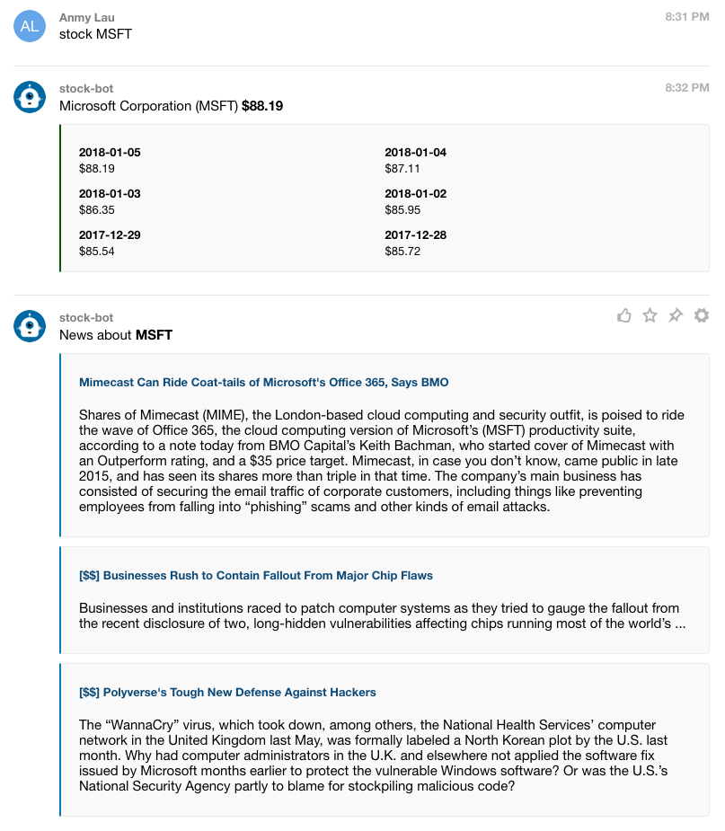

# glip-stock-bot

A stock quote bot for [Glip](https://glip.com/).

I created this project based on this [youtube video tutorial](https://www.youtube.com/watch?v=67yifrwUNsw). If you don't know how to setup and run this project, please refer to that video.


## Setup

```
yarn install
cp .env.sample .env
edit .env
```

Follow the [youtube video tutorial](https://www.youtube.com/watch?v=67yifrwUNsw).


## Run

```
yarn start
yarn ngrok
```


## What does this bot do?

Specify a stock symbol, and you will get its quotes for the recent 6 days together with 3 recent news about this stock.


